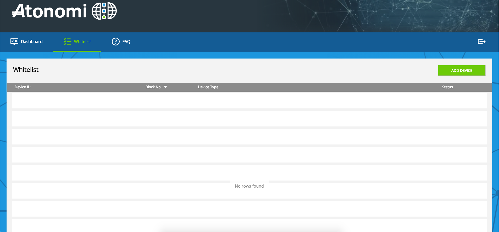
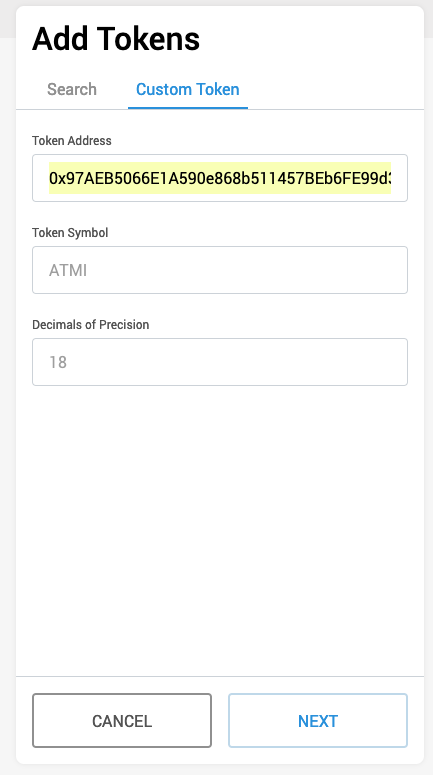
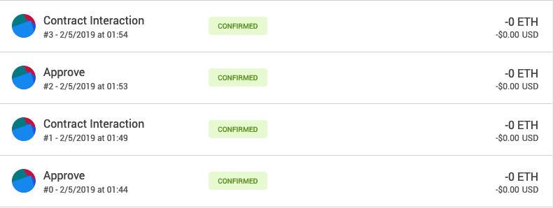
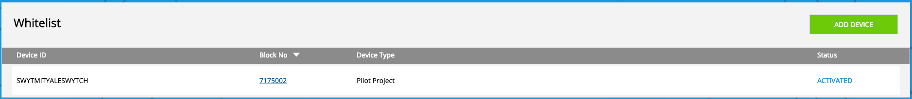

# Setting up an Atonomi SDK

Atonomi is a project which does device based reputation services and offers something called "protected sessions" which is useful to communicate through secure channels. In theory, this should be lighter than TLS/SSL but requires an additional layer of setup that we detail in this document. On a high level, there are a few things we need to get before we can register using Atonomi:

- Install the [metamask extension](https://http://metamask.io) on a compatible browser (BEWARE: there are multiple impersonations of the metamask wallet, so please don't download other extensions except the one linked above)

- Have ~10 ATMI tokens and ~0.1ETH to cover for the gas costs while triggering the Atonomi smart contract

- Have the raw publicKey (64 bytes long) of your metamask account handy. This is needed to register the device on Atonomi and can't be done with the Ethereum Address (which is 20 bytes long). This is a relatively non trivial process and there don't seem to be any existing services that do it unless you want to type your publickey on a random internet form. This can be done using either `pyethereum` or using the package `eth_keys`

1. eth_keys (the easy way but the package is not well maintained)
```
pip3 install eth_keys

f3f0b50de1779520a6114e33420440c2b9fb4097c1f2975b95614db9d5476de5
ethereum.utils.sha3(ethereum.utils.encode_int32(x) + ethereum.utils.encode_int32(y)
```

Then open a python3 client and run the following:

```
from eth_keys import keys
from eth_utils import decode_hex

privateKey = "" # insert your private key here
x = decode_hex(privateKey)
priv_key = keys.PrivateKey(x)
pub_key = priv_key.public_key
print(pub_key)
```

2. pyethereum (up to data package with active maintenance)

```
git clone https://github.com/ethereum/pyethereum/
cd pyethereum
python3 setup.py install
```

Then open a python3 client and run the following:

```
from ethereum import utils as eutils

k = 'INSERT PRIVATE KEY IN HEX WITHOUT 0x'
# Verify if you have the correct privkey
eutils.privtoaddr(k).hex()
output should be a hex representation of the private key

# get the publickey now
k = eutils.normalize_key(k)
x, y = eutils.privtopub(k)
pubkey = "0x" + (eutils.encode_int32(x) + eutils.encode_int32(y)).hex()
# the publickey in ethereum is a concatenation of the two EC points that are generated using
# our private key
```

Store the pub_key for later use during registration.

Now we need to head to https://registration.atonomi.net/ to register the devices. Use the previously shared login credentials to logon to the platform. You should be greeted by a screen with a green "Add Device" button followed by a table of registered devices. Click on the green "Add Device" button and it should ask you for three fields:

1. Device ID: A unique device ID that will be associated with this particular installation. Start typing characters and it should suggest the starting characters as predefined by Atonomi (Atonomi hardcodes a unique prefix for each account once you request access to their services)

2. PublicKey: The publickey that we derived earlier using python. A wrong publickey will still result in a valid transaction , but one would not be able to use their device as intended since the derived publickey from the private key would not match.

3. Device Info: This is some metadata that is required by atonomi to know what their clients are using their services for. This can ideally be any string and  shouldn't affect anything on the blockchain

Once this is done, one can press on the green "Register Device" at the end of the form. This should ideally open up a confirmation box which and need you to use metamask to sign the transaction to be propagated on the blockchain.

Depending upon the vendor and manufacturer, there is a maximum of two transactions that need to be authorized.

1. To send ATMI to verify the device manufacturer
2. To register the device itself

If your device already belongs to the list of verified manufacturers defined by Atonomi, you will not be shown this transaction dialog. Once you are shown the transaction dialog, you would need to verify the gas cost and propagate the transaction. Then depending on the ethereum network's speed, you would need to wait for a couple blocks to confirm that your transaction(s) was(were) sent successfully. Once you're done with 1/2 transactions for the register page, you must be able to see your device in the table under "whitelist". The deviceID should be in hex since we haven't activated the device yet, which we will be doing shortly:

Now we can proceed to activate the device at https://activation.atonomi.net/. Here, you should find a four point checklist to ensure that you have metamask setup for this stage. In the form at the bottom of the page, you are required to enter the deviceID that you selected at the activate screen. Once you proceed to doing that, you should be faced with another two transactions similar to the register page:

1. To send ATMI to activate the device manufacturer
2. To activate the device itself.

This process is relatively seamless and once this is done, the `whitelist` page on the registration screen should now show your DeviceID instead of the characters in hex earlier.

### Images for reference






